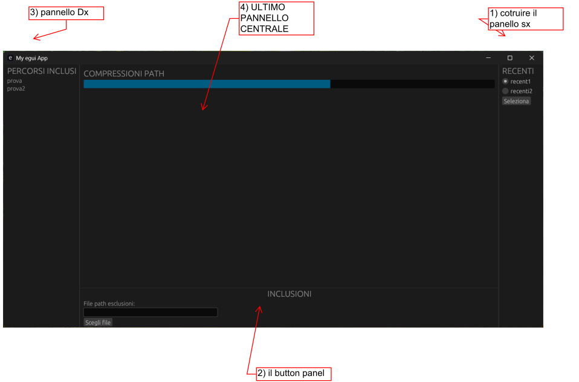

# Progetto egui compressore
Questa e' la descrizione


Collegamento: 
[helpGui.pdf](pdf/HelpGUI.pdf)


## METODO DI COSTRUZIONE

    per costruire una nuova applicazione seguire questo ordine :
questo ordine : 
1) primo lo stato dei futuri widget
2) secondo creare il layout con la divisione dello schermo
3) creare i widget

STATO FUTURI WIDGET
    lo stato dei futuri widget 

```shell
cargo run
```
